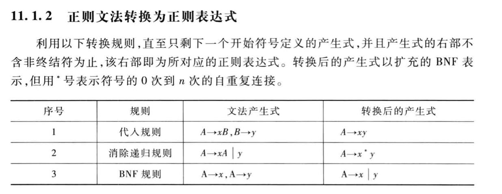
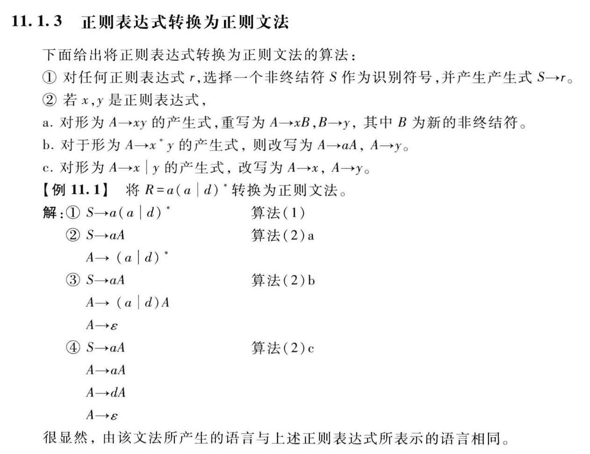
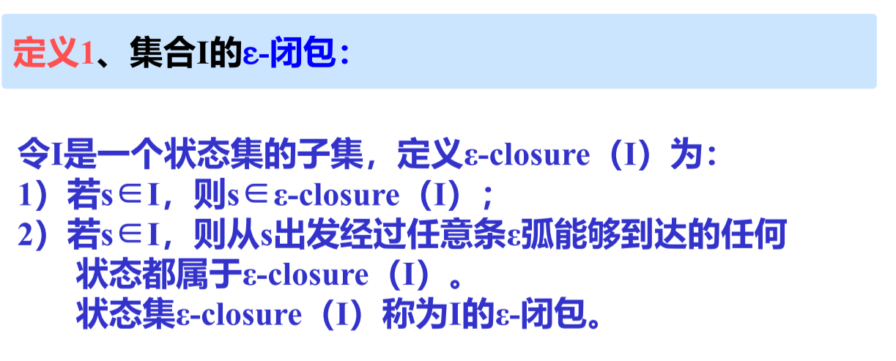
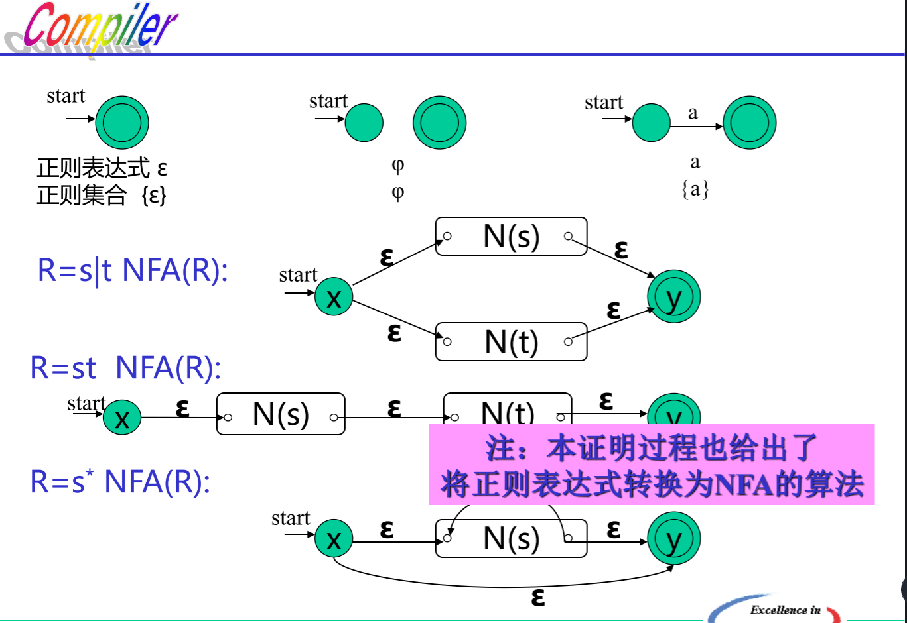
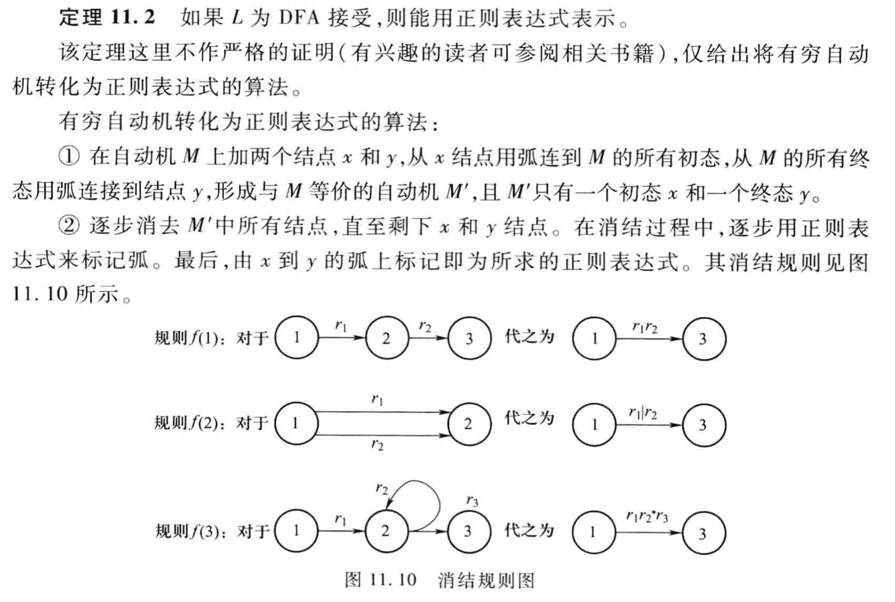

> 本章内容一图以蔽之
> 

----

## 正则文法2正则表达式

代入规则和BNF规则比较直观，消除递归规则使用了**正则表达式中的闭包运算**，最终达成了把文法的多个产生式改写成单个表达式的目标。

## 正则表达式2正则文法

前文的逆运算

## NFA2DFA

> **预备知识：**
>
> $\varepsilon-closure$的计算方式
>
> 
>
> $I_{x}$的计算方式
>
> 

多值的状态转移函数导致了NFA在计算机工程上很难实现，每次输入新字符时无法判断下一状态是什么（如果硬要写的话可能需要加上一些试探回溯的步骤），所幸已经有证明：任一NFA都可以经过确定化的步骤后转化为DFA。下文介绍一种NFA的确定化算法。

先说一些个人理解。NFA不确定性的来源就是$\varepsilon$边和多值边，我们要想把NFA转化为DFA就必须以某种方式把这些边剪除掉。如何剪除这些边呢？我们使用一种类似聚合的办法，把 $\varepsilon $ 边所连接的状态聚合为一种状态，把多值边的目标状态聚合为一种状态。经过这样的变换，$\varepsilon$ 边和多值边就变成了“状态内的边”了，因此在重新定义的状态上确立的状态机就是DFA。对应到算法中：计算 $\varepsilon-closure$ 闭包的过程完成了聚合 $\varepsilon$ 边的任务，计算 $I_{x}$ 的过程完成了聚合多值边的任务。

下面介绍构造DFA的算法步骤：

1. 初始化DFA的状态集合 S ，输入字母表$\sum$ （NFA的字母表去除 $\varepsilon$），状态转移函数集合 $\delta$，初始状态$S_{0}$，终态集合Z，待处理状态队列 Q
2. 计算NFA初态的 $\varepsilon-closure$，记为初态 $S_{0}$，加入 状态集合S、待处理状态队列 Q
3. 从Q中取出一个状态$S_{t}$，遍历输入字母表$\sum$ ，设输入字符为x，计算$S_{t}$的$I_{x}$闭包，此时我们构造出了新的状态转移函数$I_{x}=\delta(S_{t},x)$ ，将其加入状态转移函数集合 $\delta$。若$I_{x}$不在状态集合中，则记录为状态 $S_{t}$，将其加入状态集合 S、待处理状态队列 Q。
4. 重复步骤3直到Q为空。
5. 遍历状态集合S，计算 $S_{t} \cap Z' \neq\phi$ ($Z'$为NFA的终态集合)，若该式成立则将$S_{t}$加入终态集合Z

## DFA的最小化（化简）

## 正则表达式2DFA

证明过程就是把正则表达式的归纳定义走了一遍，通过证明DFA支持正则表达式的初值和迭代算符，进而证明了任何正则表达式都有对应的DFA。下面给出一个转化的算法步骤

1. 正则表达式2正则文法
2. 画出每个推导式的DFA
3. 根据证明的方式，聚合多个DFA

## DFA2正则表达式

