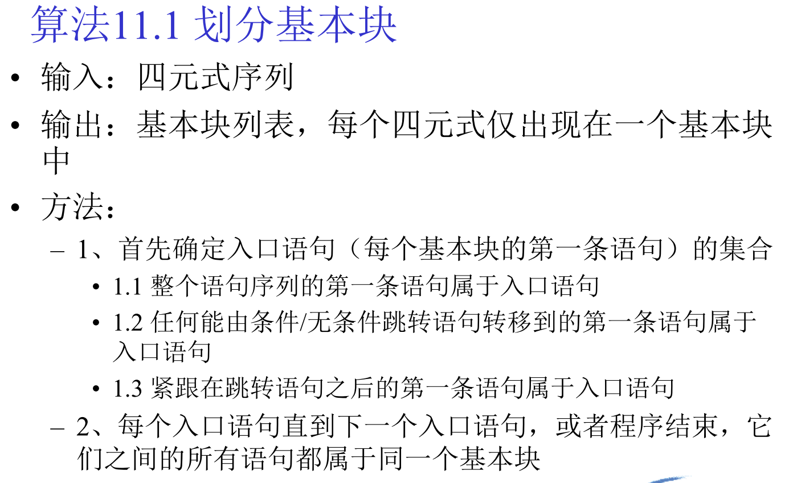
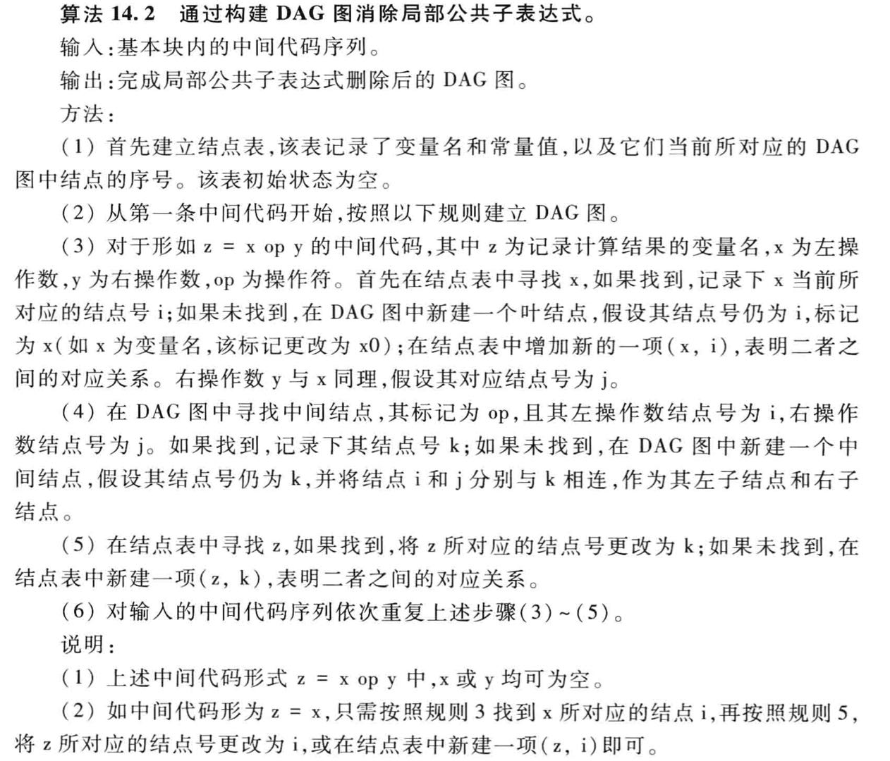
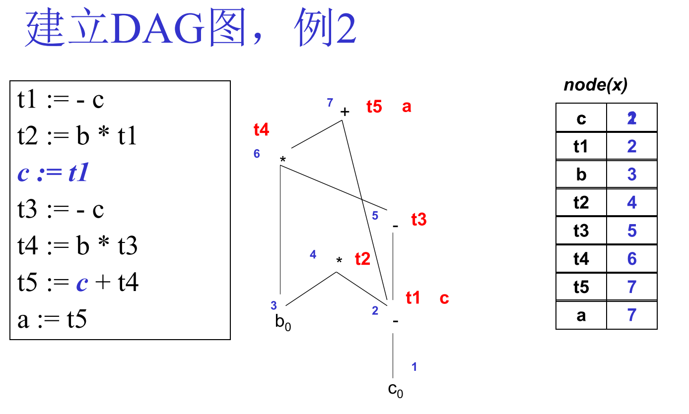
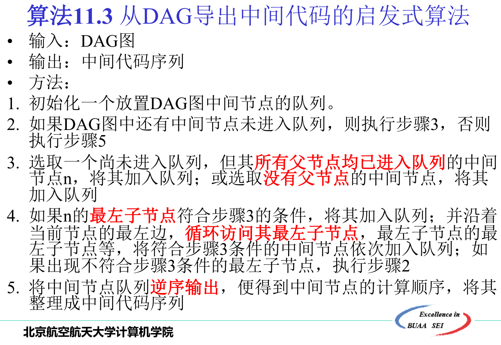
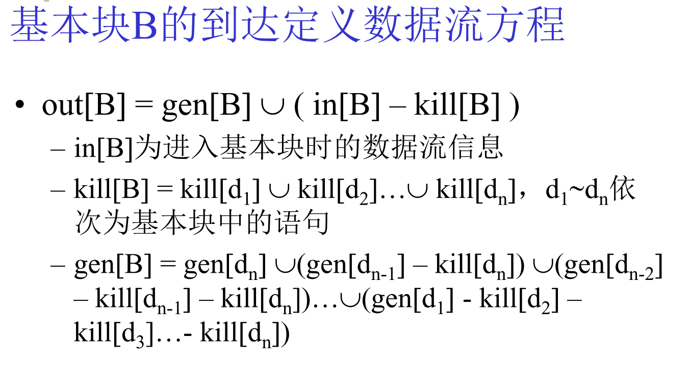
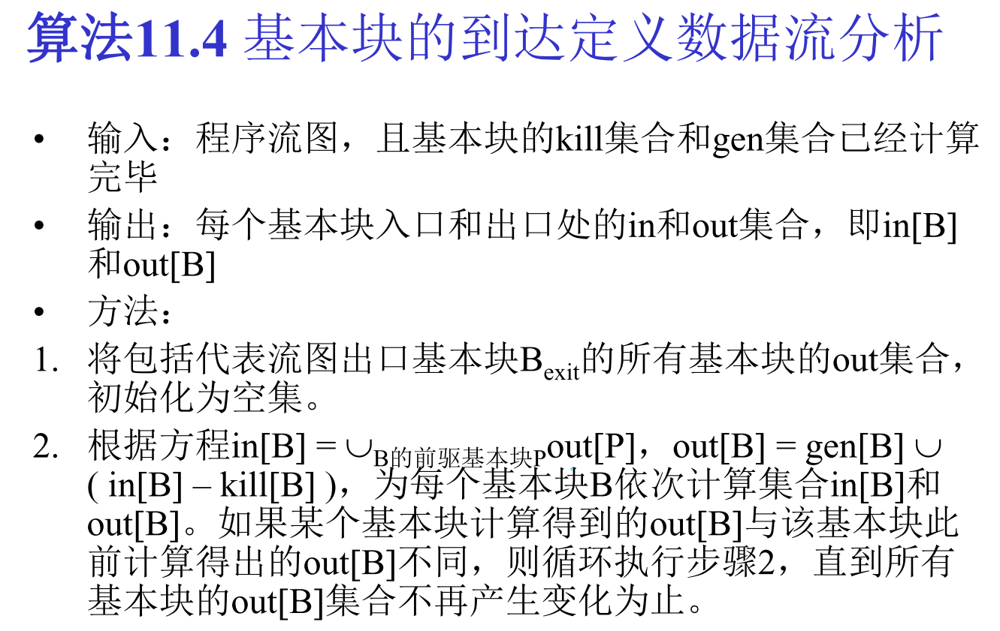
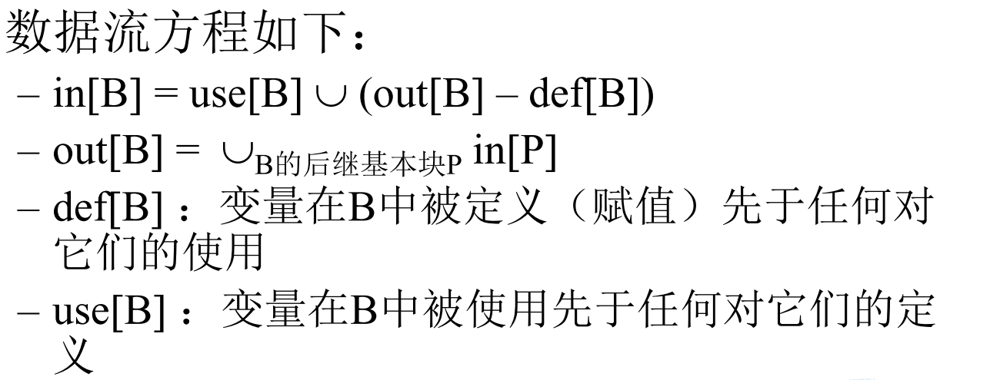
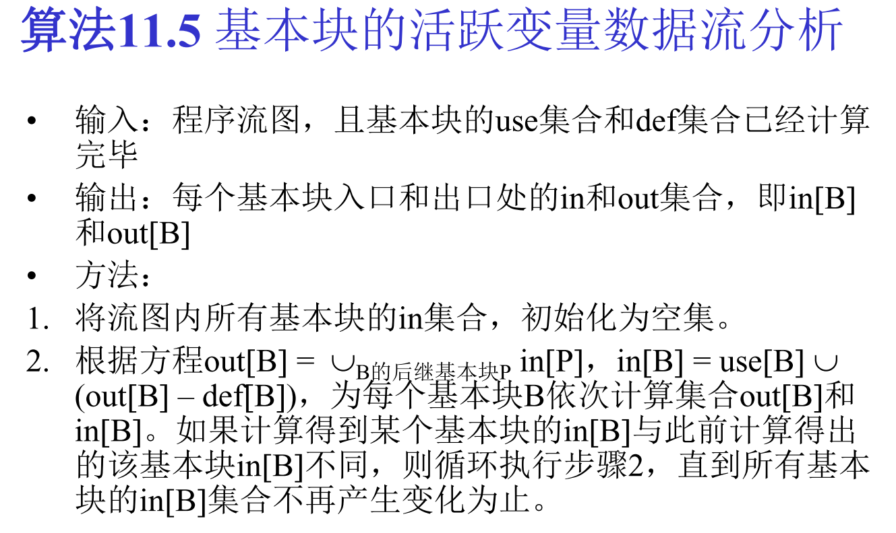
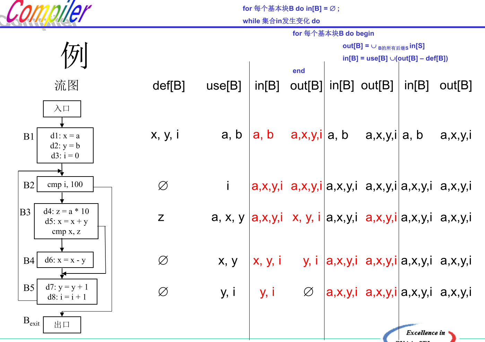
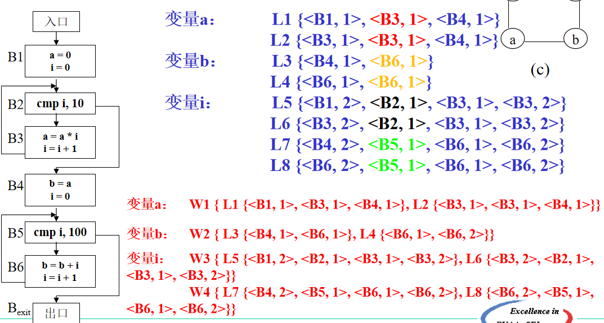

-----

## 基本块划分

标记**跳转语句**的两个出口就可以得到基本块的入口语句

---

## DAG图

**从中间代码建立DAG图**

建立node表，逐步建立DAG图，维护表内的<变量-节点>对应关系。注意在def之前就被use的变量$C$需要引入$C_0 = C$

**从DAG图导出中间代码**

按照拓扑序得到导出序列，使用导出序列的逆序生成中间代码。

## 数据流分析

### 到达定义分析

**数据流方程**
$$
out[B] = gen[B] \cup ( in[B] - kill[B] )
$$
**基本块的到达定义分析**

1. 计算gen、kill【注意kill包含后续的控制流中的语句】
2. 初始化in、out
3. 按照数据流方程算in、out【先算out后算in】
4. 若第三步有变化，则再迭代一轮，否则结束分析

----

### 活跃变量分析

#### 活跃变量数据流分析

- 先计算每个基本块的def、use【注意def是在使用前定义的变量】
- 初始化in、out为空
- 按照数据流方程计算in、out一轮
- 前一步如果有更新in、out就再迭代一轮，否则结束分析

#### 冲突图

变量X在变量Y的定义点是活跃变量，那么变量X,Y是冲突变量，这意味着它们在寄存器分配时不能同时使用同一个寄存器。

### def-use链

变量的定义-使用链，是指变量的某一定义点，以及所有可能使用该定义点所定义变量值的使用点所组成的一个链 。同一变量的多个定义-使用链，如果它们拥有某个同样的使用点，则合并为同一个网。

具体计算需要先使用到达定义数据流分析得出。 

---

## SSA

**算法概览**

1. 建立CFG流图
2. 通过CFG构造Dominator-tree （[算法参考](https://blog.csdn.net/Dong_HFUT/article/details/121375025)）
3. 在Dominator-tree上计算每个节点的Dominator Frontier（[算法参考](https://blog.csdn.net/dashuniuniu/article/details/52224882)）
4. 使用Dominator Frontier插入ϕ指令（支配边界获取了需要Φ函数的精确的位置：如果点A定义了一个变量，那个这个变量将会达到所有点A的支配点，只有在当我们离开这些点，而且进入支配边界，我们才必须考虑其他流程会带着其它相同变量的定义）
5. 最后重命名变量。
