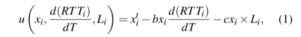
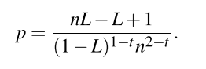
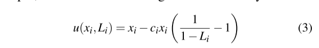
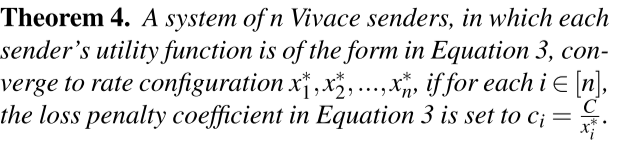
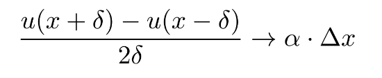
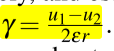
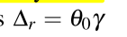
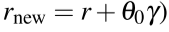
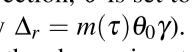
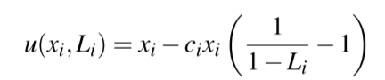

> PCC Vivace: Online-Learning Congestion Control
> 
> Vivace pronounce as / vɪˈvɑtʃi / not / vɪˈvɑs /

## Abstract

作者在PCC的基础上，借助机器学习中在线学习（凸优化）的概念设计了Vivace。相较于PCC而言，Vivace在两个重要的地方做了改进：

> - rate control protocol【速率控制协议】
> - a utility function framework【效用方程框架】

经过理论证明和实验的验证，Vivace具有以下的优点：

> - Vivace significantly outperforms traditional TCP variants, the previous realization of the PCC framework, and BBR in terms of performance (throughput, latency, loss)【性能比TCP variants、PCC、BBR强】
> - convergence speed【收敛速率】
> - alleviating bufferbloat【缓解缓冲区膨胀---考虑时延的结果】
> - reactivity to changing network conditions【适应高度变化的网络】
> - friendliness towards legacy TCP in a range of scenarios. 【对TCP友好】
> - Vivace requires only sender-side changes and is thus readily deployable【易于部署】

## 1.Introduction

作者先定义了一个优秀的拥塞控制算法应该具有的特征（这个定义应该是方便凸显自己的算法的优势的）：

> - First and foremost, a congestion control architecture should be able to **efficiently utilize network resources** under varying and **complex network conditions**. This includes optimizing for **throughput**, **loss**, and **latency**, and doing so in a **plethora of environments** — potentially with non-congestion loss [8], high-RTT cross-continent links, highly dynamic networks such as WiFi and LTE links, etc.【性能要强】
>
> - Second, congestion control should **guarantee quick convergence to stable and fair rates** when **multiple senders** compete over network resources.【收敛性（快、稳定）和公平性要好，而且要在多个sender的情况下】
>
> - Last, a congestion control scheme should be easy and safe (e.g., sufficiently friendly to existing protocols) to **deploy**【兼容旧体系】

在占据了定义的制高点后，作者开始批判传统算法，例如CUBIC、Illinois、Vegas：

> Traditional algorithms [6, 15, 23] fail to satisfy the first two requirements; their performance can be as high as 10× away from the optimal under non-congestion packet loss [11]【传统算法性能只能达到最优性能的不到十分之一】

批判完传统算法之后，又把炮口朝向了最近的新算法，例如Remy、BBR、PCC：

> - Remy-generated TCPs are inherently prone to **degraded performance** when the actual network conditions deviate from input assumptions.【Remy还残留了TCP的硬连接方案】
> - BBR and PCC Both fail to achieve **optimal low latency** and exhibit far-from ideal tradeoffs between **convergence speed and stability.**【BBR和PCC都没有一个好的收敛性】
> - BBR exhibits high rate variance and high packet loss rate upon convergence.【BBR稳定性差、收敛时丢包多】
> - PCC convergence time is overly long【PCC收敛时间长】
> - BBR’s model of the network does not reflect the complexities of reality, performance can suffer severely.【  】
> - BBR and PCC are both highly aggressive towards TCP【BBR和PCC都对TCP不友好】

终于，作者把能拥塞算法界的所有算法都狠狠批判了一遍以后，提出了自己的解决方案（I solved this problem），并且给出了自己在这个方案上的主要工作内容（也是本文主要介绍的内容）。

首先我们需要明确，Vivace是PCC的改进版本。正如摘要中所述，Vivace改进了PCC两个部件：①a utility function framework，② a learning rate control algorithm

> Vivace adopts the high-level architecture of PCC – a utility function framework and a learning ratecontrol algorithm – but realizes both components differently.

在第一个部件，即效用方程上，Vivace的贡献在于引进了**learning-theory-informed framework**【所以这个到底是啥啊啊啊啊】来做utility的计算（PCC在效用函数的选择上显得很随意），并且这一次Vivace考虑了**时延最小化**和**TCP友好性**（PCC没有证明考虑时延时的收敛性，PCC没有做到TCP友好性）【我感觉考虑了时延就等于考虑了TCP友好性？？？？】。

在第二个部件，即速率控制算法上，Vivace使用了基于梯度上升（一种可证明的渐进式在线学习优化）的速率控制算法，达到了：

> - high utilization of network capacity
> - swift reaction to changes
> - fast and stable convergence

## 2.Rate-Control Through Online Learning

因为PCC在异构的效用方程下的结果并不尽如人意，作者从博弈论的无悔算法获得了灵感。无悔算法保证：

> In addition, results in game theory establish that online learning algorithms “play well” together, in the sense that, under the appropriate conditions, global convergence to a stable equilibrium is guaranteed when there are multiple decision makers.

同时，在线学习能在不确定的条件下做出最大化正确性决定：

> Online learning provides a useful and powerful abstraction for decision making under uncertainty.

> 关于在线学习的背景知识：
>
> 在线学习(Online Learning) - 别来无恙的文章 - 知乎 https://zhuanlan.zhihu.com/p/403393226
>
> 在线学习（Online Learning）导读 - 吴海波的文章 - 知乎 https://zhuanlan.zhihu.com/p/36410780

所以作者把rate control的任务抽象为了一个在线学习的任务，这一个insight 在PCC已经出现过了：

> A traffic sender repeatedly selects between sending rates. After sending at a certain rate for “sufficiently long”, the sender learns its performance implications by translating aggregated statistics (e.g., achieved goodput, packet loss rate, average latency) into a numerical utility value, and then adapts the sending rate in response. 

在15年的PCC模型中，虽然使用了在线学习的理念，但仍然没有挖掘出在线学习的全部潜力：

> First, Allegro uses a somewhat arbitrary choice of utility function
>
> - fair convergence is not provably guaranteed when utility functions are latency-aware【考虑时延的效用方程未被证明是公平收敛的】
> - reasoning about fundamental tradeoffs in parameter settings is difficult【推理参数的调整是很难的，不成体系】
> - there is no theoretical understanding of what happens when Allegro senders with different utility functions interact with each other【异构发送者的互动？】
>
> 
>
> Second, Allegro inherently ignores the information reflected in the utility when deciding on step size
>
> - ε是固定的，大了难以收敛，小了收敛太慢 	
> - 没有充分利用utility 反应的信息
>
> 

为了解决15年PCC模型的问题，Vivace使用了在线学习+凸优化的思想，重新实现PCC高层架构的两个关键部分：（1）效用函数框架，以及（2）学习速率控制算法，达到了一个比较好的效果：

> - First, Vivace relies on a new, learning-theory-informed framework for utility derivation [12], which guarantees multiple competing Vivace senders will converge to a unique stable rate configuration that is fair and near-optimal.【保证多个异构决策者会收敛到一个公平点】
>
> - Second, Vivace employs provably optimal gradient-ascent-based no-regret online optimization [37] to adjust sending rates, taking into account not only the direction (increase/decrease) that is more beneficial utility-wise, but also the extent to which increasing/decreasing the rate impacts utility.【基于梯度上升+无悔在线优化调整发送速率，保证收敛速度】

之前一直提到无悔学习，或者说无遗憾学习（no-regret learning）,之前学经管的时候做过一点最小后悔值的计算，但对于无悔学习的收敛性没有认识，这里我补充了一些背景知识（**非常粗浅的了解，还有待学习**）【（选择更好的u这里体现了无悔？】

> 一般来讲，采用基于后悔值的学习方法以后，每个智能体根据各个行为的后悔值做出行为选择。如果一种算法能够保证最大后悔值渐进的变为零，那么该种算法就可以被称作无悔学习算法。
> 最著名的无悔学习算法就是后悔匹配算法(regret matching)，在每一个决策时刻，每个智能体按照每个行为的后悔值的概率做出选择，即具有最大概率的行为被选中的机会越大。在多智能体系统中，如果所有的智能体都采用相同的无悔学习算法，例如后悔匹配算法，那么所有智能体的联合行为将渐进地收敛于一组无悔点。换句话说，一组无悔点也可以被看作一种理想情况或者说一种高效的运行环境。在无悔点集合上，每个智能体所得到的平均回报不少于其它行为所能产生的回报。

作者在文章中分析了无悔学习的优势与劣势（实际上按作者的描述这个劣势对于拥塞控制算法影响并不大）

> 优势：
>
> - no-regret provides a formal performance  guarantee for individual senders across all network conditions【在所有的网络环境下，无悔学习对每个发送者**正式地**保证了性能】
> - no-regret provides a powerful lens for **theoretical analysis**, which we will use to reason formally about convergence with multiple competing no-regret senders, even with heterogeneous utility functions across the senders, and also about tradeoffs between resilienceto non-congestion loss and loss upon convergence.【无悔学习提供了关于异构的PCC发送者的收敛性理论分析的依据，并且提供了关于稳定性和损失率的平衡的分析方法】
>
> 劣势：
>
> - 动态环境中，无悔算法所逼近的最佳策略是不断变化的，如果逼近的太慢那这个调整就没有意义了。如果遗憾在T个时间单位内消失到一个理想的低值，那么相对于每T个时间单位内的最佳固定策略而言，无遗憾保证就适用。

## 3 Vivace’s Utility Framework

为什么要用梯度呢？

> A single sender on a link with a large buffer sends at a rate of twice the capacity of the link for a single MI; then, in the next MI, it tries a slightly lower but still over-capacity rate. Such a sender would experience higher absolute latency in the second MI than in the first MI (since the link’s queue is only further lengthened), even though lowering the rate was clearly the right choice.
>
> **To learn within a single MI** that lowering the rate is more beneficial, the sender examines the rate at which latency increases or decreases.【加入latency的考虑】

### 3.1 Stability and Fairness

在给出Vivace采用的效用方程后，Vivace在此基础上展开了稳定性和公平性的分析，作者先引入了博弈论中关于凹函数的理论（如果一个可微函数f它的导数f'在某区间是单调递减的，f就是凹的)

> When t ≤ 1, the family of utility functions in Equation 1 falls into the category of “**socially-concave**” in **game theory** [12].

这里利用了博弈论的理论证明了：一组严格凹函数下的博弈会陷入一组纳什均衡点。再配合上凸优化的梯度上升理论+作者自己搞的信心模块，就保证了收敛的速度也很快。

> - guarantees high performance from the individual sender’s perspective
>
> - ensures quick convergence to a global rateconfiguration

作者预设了一个场景：N个发送者竞争一个具有瓶颈的链路

> Theorem 1. When n Vivace-senders share a bottleneck link, and each Vivace-sender i’s utility function is defined as in Eq. 1, the senders’ sending rates converge to a fixed configuration (x∗1, . . . ,x∗ n) such that x∗ 1 = x∗ 2 = . . . = x∗n
>
> Theorem 2. Let C denote the capacity of the bottleneck link. If b ≥ tn^2−t^ C^t−1^, then the latency in the unique stable configuration is the base RTT.

### 3.2 Random Loss vs. Congestion

> In a system of n Vivace senders, each ploss-resilient, the loss rate L of each sender i in equilibrium (with no random loss) satisfies:
>
> 
>
> 
>
> 推论：When n → ∞, the congestion loss rate on convergence approaches the random loss resilience p!【发送者趋近于n时损失率趋近设定的忍受率】
>
> 推论：withstanding more random loss comes at the cost of suffering more loss upon convergence for a large number of senders.【随机损失的忍受是以收敛时的损失率为代价的】

### 3.3 Heterogeneous Senders

Vivace可以通过修改异构发送者的效用方程达到控制链路占用量的效果，这对于未来的SDN是有好处的。

> Vivace’s utility function framework, in contrast, provides flexibility in resource-allocation. 【ci调整了对损失率的惩罚值】
>
> 

不过我猜异构发送者不支持时延based，不然就不会只写一个loss-based的了。

> Hence, one can flexibly adjust the bandwidth allocated to each sender at equilibrium by tuning Vivace’s param-
> eters {ci}
>
> $c_{i}$参数的设置方法：
>
> 

## 4 Vivace’s Rate Control

最开始慢启动，然后在效用第一次减小后进入速率控制阶段（不再退出）

### 4.1 Key Idea and Challenges

> when the utility functions are strictly convex, which is satisfied when t < 1 in our utility function formulation

作者指出：满足上面条件的效用方程可以保证两件事情：（本文老生常谈的话题了）

> - Each sender is guaranteed that employing Vivace is (asymptotically) no worse than the optimal fixed sending rate
> 	in hindsight【即使在极度变化的环境也适用】
> - When multiple senders share the same link, quick convergence to an equilibrium point is guaranteed

所以具体怎么控制呢，其实就是把原本PCC的步长修改了一下。以前的步长是ε的倍数，收敛效果不好。现在加了点凸优化对步长的调优方案——梯度（这背后的理论是无悔选择）

### 4.2 Translating Utility Gradients to Rates

先测试两个MI的u值，然后计算梯度，最后给梯度乘一个系数

> 	

当然，光是这样收敛速度还是不太够，作者又加上了PCC的老思路——信心模块。对于同向的增长，我们让他加大力度。对于突然变向的情况，我们把信心模块重置。

> 

接着，作者提出了一个异常处理的机制——梯度可能会因为偶发因素而变得异常高，所以需要给步长加一个限定值

> Whenever Vivace’s computed rate change (∆r) exceeds ωr, the effective rate change is capped at ωr

这个限定值是动态变化的，Δr > wr 那么w就变大，Δr < wr 那么w就变小，如果速率控制的方向变化了w就重置：

> - Specifically, ω is updated to ω = ω0 +k · δ following k consecutive rate adjustments in which the gradient-based rate-change ∆r exceeded the dynamic change boundary, 
> - Whenever ∆r ≤r·ω, Vivace recalibrates the value of k in the formula ω=ω0+k·δ to be the smallest value
> 	for which ∆r ≤ rω.
> - k is reset to 0 when the direction of rate adjustment changes

### 4.3 Contending with Unreliable Statistics【tricks，其实也是引入了硬连接】

#### Estimating the RTT gradient via linear regression.

一言以蔽之：用线性回归求RTT的梯度【上周讲错了x_x】

#### Low-pass filtering of RTT gradient.

使用低通滤波机制忽略小的、短暂的延时抖动【(> 0.01)的抖动才纳入计算】

#### Double checking abnormal measurements.

这个补丁是对一种奇怪的现象（偶尔，测量结果会导致 "反直觉 "的观察）进行处理——发送速率升高反而延时降低，作者认为这是一个不太可能发生的事情，所以要recheck一次。如果结果显示确实是这样的，那就把doublecheck的Δr 取个平均。

> even with complex conditions it is highly unlikely that sending faster is the cause of lower loss; more likely, this is due to measurement noise or changing conditions (e.g., another sender reducing its rate).

#### MI timeout.

一个MI窗口的信息大概应该在一个RTT返回回来，如果很久都没回来，说明网络出问题了，所以当超过Timeout时间还没有拿到足够的一个MI的RTT信息，Vivace就会把发送速率减半。

### 4.4 TCP Friendliness

作者认为loss-based 的算法是必然会抢占TCP的带宽的，而Latency based的算法又因为TCP系列的算法是lose-based的，对延时不感兴趣，所有当延时上升的时候，latency based的算法主动谦让，TCP系列得寸进尺，延时维持高位，latency based的算法就被TCP系列支配了。

所有类似PCC Vivace这样混合型的算法可能可以解决这个困境。作者预设了两个场景：

> - a Vivace sender is the only sender on a certain link. It tries out two rates that exceed the link’s bandwidth, and the buffer for that link is not yet full.【not full的链，纯Vivace单流】
> - the Vivace sender is sharing a link that is already heavily utilized by many loss-based protocols like TCP CUBIC and the buffer is, consequently, almost always full.【full 链， 多TCP+单Vivace】

经过分析，前者把latency纳入了考虑，后者由于latency在此时变化不大，所以退化为了loss-based去和TCP抢带宽了（PCC Allegro）

但我还是有几点疑虑：

- full链，多Vivace流会怎么样？是否也会退化？退化以后的收敛性如何？
- full链，多TCP单Vivace中，Vivace作为loss-based抢占能力如何？退化以后的收敛性如何？

## 5 Implementation and Evaluation

### Latency awareness (100Mbps, 30ms RTT Emulab bottleneck link)

PCC Vivace很好地解决了缓冲区膨胀的问题，因为他是一个考虑了时延的算法

### Rapid reaction to network changes (10-100Mbps, 10-100ms RTT，0-1% random loss)

- CUBIC不能应对random loss，所以维持低位

- BBR不能快速应对RTT的变化【因为BBR中probeRTT、probeBDP是不同时间进行的？】
- Allegro不能在瓶颈带宽下降的时候快速减小发送速率——这会导致丢包

### Fair equilibrium (100Mbps, 30ms RTT, 75KB buffer)

肉眼可见，PCC Vivace的收敛性（稳定、速度）更好

### TCP Friendliness

- BBR占据接近15%的带宽（不管有多少个TCP竞争者）
- PCC Vivace在网络不拥堵（发送者少）的情况下，抢不过TCP，当TCP发送者多起来的时候，PCC Vivace可以抢资源

### Flexible equilibrium by tuning utility knobs

通过调整Ci，可以修改PCC Vivace流在带宽中的占比（纯PCC Vivace竞争）

### Limitation in Extremely Dynamic Networks

LTE 有待改进的地方：可能是因为在**急剧**变化的网络下Vivace计算的结果来的不够及时。

