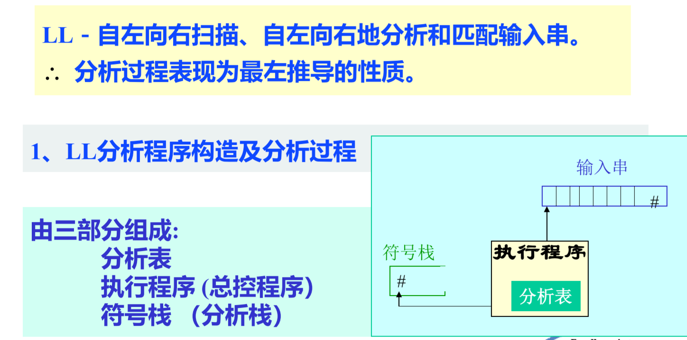
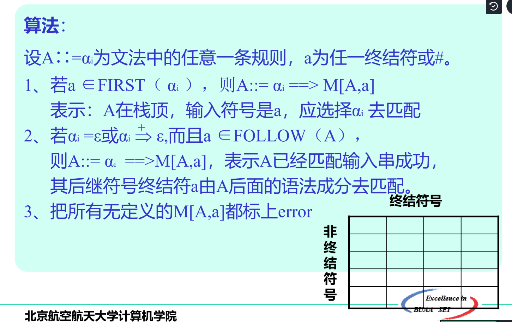
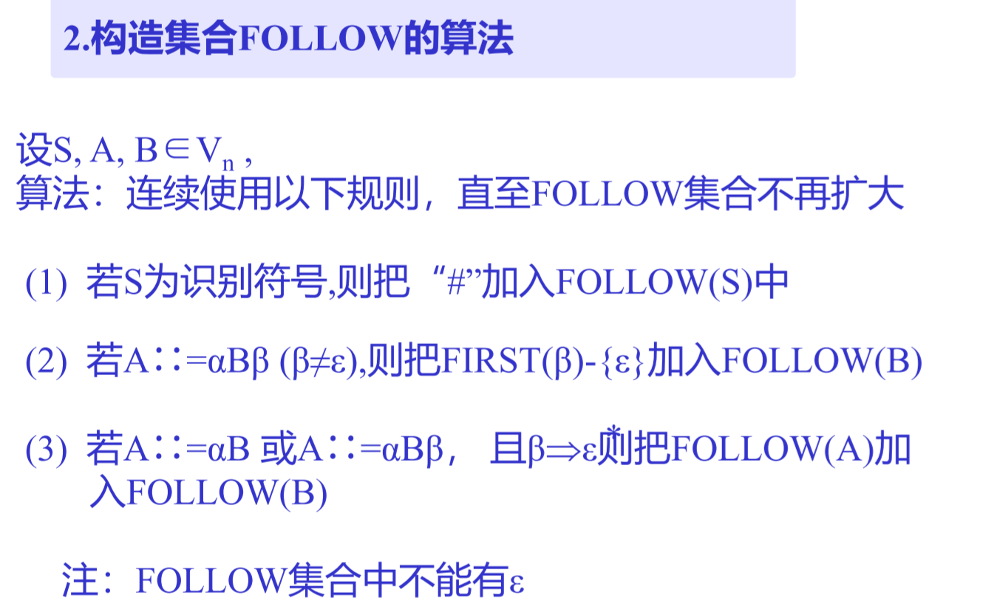

语法分析的基本功能是根据文法规则，从源程序单词符号串中识别出语法成分，并进行语法检查。换言之语法分析的任务就是识别符号串S是否为某语法成分。

语法分析有两大类分析方法：

- 自顶向下分析（推导过程）【需要解决左递归问题和回溯问题】
	- 递归子程序法
	- LL分析法

- 自底向上分析（规约过程）【需要解决句柄的识别问题】
	- 算符优先分析法
	- LR分析法

# 自顶向下分析

给定符号串S，若预测是某一语法成分，则可根据该语法成分的文法,设法为S构造一棵语法树， 若成功,则S最终被识别为某一语法成分,即 S属于L(G[Z])，其中G[Z]为某语法成分的文法，若不成功, 则S不属于L(G[Z])。

自顶向下分析法需要解决两个问题：左递归、回溯

## 消除左递归

### 直接左递归

我们有两种方式消除直接的左递归，第一种使用扩充的BNF表达式，第二种是把左递归改写为右递归。

#### 使用扩充的BNF表达式

使用以下两条规则可以完成改写文法的任务

#### 左递归改写为右递归

---

### 间接左递归

---

## 解决回溯

什么是回溯?

> 分析工作要部分地或全部地退回去重做叫回溯，带来了严重的低效率

为什么会存在回溯问题？

> 文法中，对于某个非终结符号的规则其右部有多个选择，并根据所面临的输入符号不能准确地确定所要的选择时，就可能出现回溯

怎么解决回溯问题，其实我们有两种方式解决回溯问题：

> - 第一种是**改写文法**，使用扩充的BNF表达式让任意两个语法成分的first集合都不相交，最终对文法的要求是: $FIRST(αi) ∩ FIRST(αj )=\phi (i\neq j)$
> - 第二种是在工程实现上使用**超前扫描**（这会带来一些性能损失，但是比回溯好）

### 构造不相交的First集合

#### 计算First集合

#### 改写文法使First集不相交

### 超前扫描（预读）

当文法不满足避免回溯的条件时，即各选择的首符号相 交时，可以采用超前扫描的方法，即向前侦察各输入符
号串的第二个、第三个符号来确定要选择的目标。

这种方法是通过向前多看几个符号来确定所选择的目标，从本质上来讲也有回溯的味道，因此比改写文法的实现更费时，但是假读仅仅是向前侦察情况，不作任何语义处理工作。

---

## 递归子程序法

需要文法是非左递归的。我们对每一个语法成分都写一个分析子程序，自顶向下调用执行。

---

## LL分析法

### 分析过程

看个例子就明白了

上面这个推导等价于一个最左推导：

### 分析表的构造

分析表的性质如下：

根据这个性质，我们很容易知道分析表的构造与First集合、Follow集合的算法有关，First集合的算法已经介绍过了，接下来介绍一下计算Follow集合的算法：

当我们计算出Follow集合后，就可以构造分析表了：

---

### 例题

# 自底向上分析

## 算符优先分析法

## LR分析法

> FIRST集、FOLLOW集的构造方法
>
> - 作为写题而言，FIRST集直接肉眼看就行
>
> 

